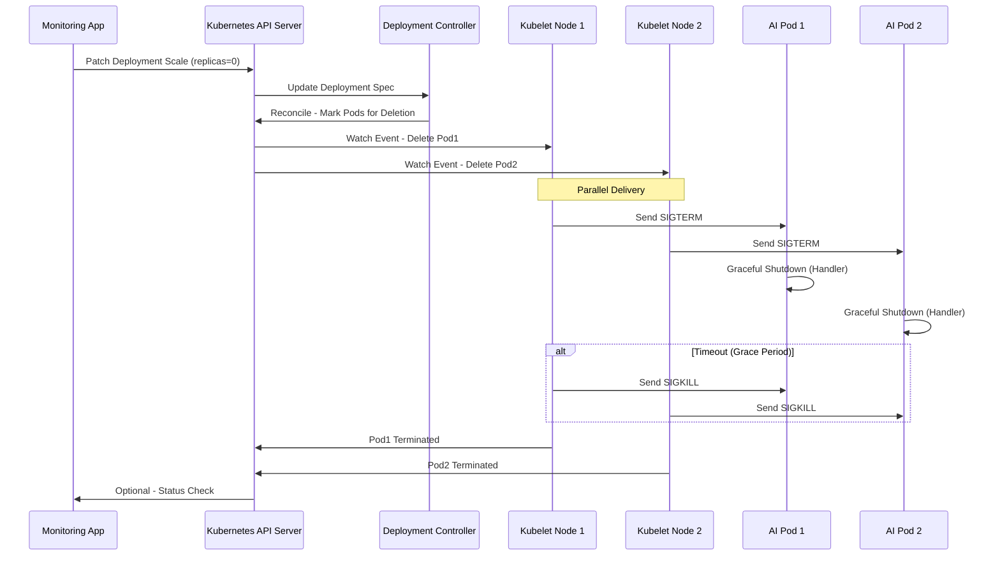
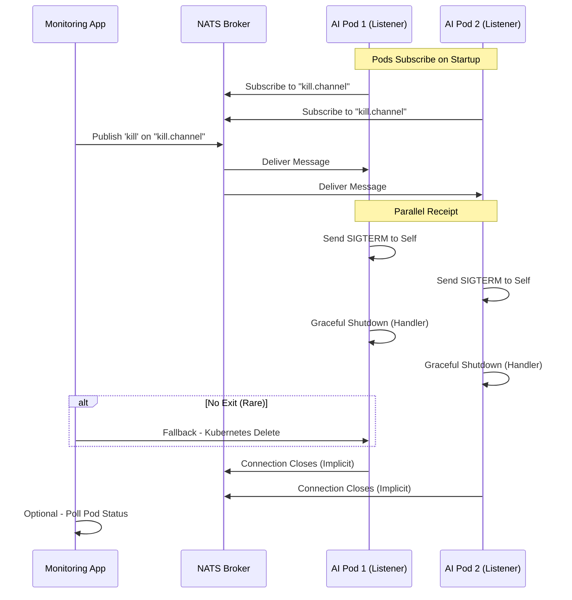

# Kill Signal System Design for Rogue AI Agents in OCP/GKE

This document outlines the design for broadcasting a kill signal to AI agent applications running across multiple pods in Kubernetes-based environments (OCP or GKE). The system ensures near-simultaneous delivery without significant delays. Two options are presented: 

1. **Kubernetes-Native Scaling to Zero** (preferred for simplicity and low latency).
2. **Pub/Sub with NATS** (for custom signaling without disrupting deployment scaling).

Each option includes:
- Architecture components.
- High-level flow diagram (text-based).
- Sequence diagram (using Mermaid syntax for rendering in Markdown viewers like GitHub or VS Code).

## Option 1: Kubernetes-Native Scaling to Zero

This approach uses Kubernetes' built-in Deployment scaling to broadcast the kill signal implicitly via pod termination. A single API call triggers parallel SIGTERM signals to all pods.

### Architecture Components
- **Monitoring App**: Detects rogue AI and patches the Deployment.
- **Kubernetes API Server**: Handles the patch request and propagates changes.
- **Deployment Controller**: Reconciles the spec and initiates pod deletions.
- **Kubelets**: Node agents that send SIGTERM/SIGKILL to pods.
- **AI Agent Pods**: Managed by a Deployment; receive signals for termination.

### High-Level Flow Diagram (Text-Based)
```
[Monitoring App] --> Detect Rogue --> Patch Deployment (replicas=0) --> [API Server]
                                           |
                                           v
[API Server] --> Update Spec --> [Deployment Controller] --> Reconcile & Delete Pods
                                           |
                                           v (Parallel Broadcast)
[Kubelet Node 1] <-- Watch --> Terminate Pod A (SIGTERM --> SIGKILL if timeout)
[Kubelet Node 2] <-- Watch --> Terminate Pod B (SIGTERM --> SIGKILL if timeout)
... (For all pods)
                                           |
                                           v
Pods Terminated --> Optional: Collect Logs/Metrics
```

### Sequence Diagram


## Option 2: Pub/Sub with NATS

This approach deploys a NATS broker for pub/sub messaging. The monitoring app publishes a kill message, which is fanned out to subscribers in each pod for self-termination.

### Architecture Components
- **Monitoring App**: Detects rogue AI and publishes to NATS.
- **NATS Broker**: Lightweight pub/sub server (deployed in-cluster).
- **AI Agent Pods**: Each runs a NATS subscriber; self-sends SIGTERM on message receipt.
- **Kubernetes Network**: Facilitates in-cluster communication via Services.

### High-Level Flow Diagram (Text-Based)
```
[Monitoring App] --> Detect Rogue --> Publish 'kill' Message --> [NATS Broker]
                                           |
                                           v (Fan-Out)
[NATS Broker] --> Deliver Message --> [Pod1 Listener] --> Self SIGTERM --> Shutdown & Exit
                  --> Deliver Message --> [Pod2 Listener] --> Self SIGTERM --> Shutdown & Exit
... (Parallel for all pods)
                                           |
                                           v
Optional: Monitor Confirms Terminations --> Fallback Delete if Needed
```

### Sequence Diagram

