# 📊 AI Agent Guardrail Framework - Complete Sequence Diagrams

## 🎯 System Overview Architecture

---

## 1. 🔄 Trace Collection and Storage Flow

### 🔍 **Flow Explanation: Trace Collection**

**Phase 1: Agent Execution (Real-time)**
1. **Agent starts task** - Begins execution with specific goal
2. **OpenTelemetry instrumentation** - Every operation creates spans
3. **Span attributes capture**:
   - `agent.id`, `session.id`, `task.id`
   - `operation_name` (e.g., "tool_web_search")
   - `tool.name`, `tool.input`, `tool.output`
   - `agent.step`, `agent.goal`, `tokens.used`

**Phase 2: Trace Processing (Continuous)**
1. **Span processor** aggregates spans into complete traces
2. **Agent state tracking** - Steps, tokens, tools used
3. **Trace completion detection** - Root span ends or `trace.complete` flag

**Phase 3: Export to Storage (Every 5 seconds)**
1. **HPOS transformation** - Convert to structured format
2. **S3 partitioning** - Organized by agent ID and timestamp
3. **Event notification** - S3 triggers monitoring service

**Key Benefits:**
- ✅ **Non-blocking collection** - Doesn't slow down agents
- ✅ **Structured storage** - Easy querying and analysis
- ✅ **Scalable partitioning** - Supports many agents
- ✅ **Real-time processing** - 5-second latency

---

## 2. 🛡️ Guardrail Evaluation Flow

### 🔍 **Flow Explanation: Guardrail Evaluation**

**Phase 1: Trace Discovery (Continuous)**
1. **S3 polling** - Monitoring service discovers new trace files
2. **Trace parsing** - Convert HPOS format to AgentTrace objects
3. **Agent configuration** - Fetch guardrail settings from registry

**Phase 2: Parallel Evaluation (Per Trace)**
1. **Guardrail selection** - Only evaluate enabled guardrails
2. **Context extraction** - Each guardrail extracts relevant data:
   - **Goal Drift**: Current goal, step sequence, trajectory
   - **Step Budgeting**: Resource consumption, efficiency metrics
   - **Unsafe Tools**: Tool usage patterns, security violations
   - **Loop Detection**: Execution patterns, repetition analysis

**Phase 3: LLM-as-Judge Analysis**
1. **Prompt generation** - Create evaluation prompts with context
2. **Arize AI Evals** - Advanced AI-powered evaluation
3. **Fallback logic** - Rule-based evaluation if LLM fails
4. **Confidence scoring** - 0-1 confidence in violation detection

**Phase 4: Violation Processing**
1. **Severity determination** - Critical/High/Medium/Low based on scores
2. **Context enrichment** - Add execution metadata and recommendations
3. **Alert generation** - Create Kafka messages for violations
4. **Metrics updates** - Update agent statistics and health scores

**Key Features:**
- 🔄 **Parallel processing** - Multiple guardrails evaluate simultaneously
- 🤖 **AI-powered evaluation** - LLM-as-Judge for sophisticated analysis
- 🛡️ **Fallback mechanisms** - Rule-based backup when AI fails
- 📊 **Rich context** - Detailed violation explanations and recommendations

---

## 3. 📡 Real-time Dashboard Updates Flow

### 🔍 **Flow Explanation: Real-time Dashboard Updates**

**Phase 1: Connection Establishment**
1. **WebSocket connection** - React app connects on page load
2. **Connection management** - Server tracks active connections
3. **Initial state** - Dashboard receives current system status

**Phase 2: Event Streaming Setup**
1. **Kafka consumer** - dashboard-updater group subscribes to topics
2. **Topic subscriptions**:
   - `guardrail-alerts` - Violation notifications
   - `agent-metrics` - Performance updates
   - `agent-status` - Agent state changes

**Phase 3: Real-time Event Processing**
1. **Violation alerts**:
   - Monitoring service detects violation → Kafka
   - Consumer processes → WebSocket broadcast
   - Dashboard shows toast notification + updates counters

2. **Metrics updates**:
   - Agent performance metrics → Kafka (every 60 seconds)
   - Dashboard updates charts and KPI cards in real-time

3. **Status changes**:
   - Agent starts/stops/errors → Kafka
   - Dashboard updates status badges and agent list

**Phase 4: Connection Health**
1. **Ping/pong mechanism** - 30-second heartbeat
2. **Reconnection logic** - Exponential backoff on disconnect
3. **Status indicators** - Green/red dot shows connection state

**Real-time Capabilities:**
- ⚡ **Sub-second updates** - Violations appear immediately
- 📊 **Live charts** - Performance metrics update automatically
- 🔄 **Auto-reconnection** - Handles network interruptions
- 🎯 **Targeted updates** - Only relevant data sent to each client

---

## 4. 👥 Agent Registration and Configuration Flow

### 🔍 **Flow Explanation: Agent Registration and Configuration**

**Phase 1: Agent Registration**
1. **Validation** - Pydantic models ensure data integrity
2. **Uniqueness check** - Prevent duplicate agent IDs
3. **Timestamp management** - Track creation and modification times
4. **Redis storage** - Cached for fast access with sorted sets

**Phase 2: Service Integration**
1. **OTEL registration** - Begin trace collection for new agent
2. **Monitoring setup** - Load guardrail configurations
3. **Buffer initialization** - Prepare trace storage structures

**Phase 3: Configuration Management**
1. **Guardrail updates** - Modify detection rules and thresholds
2. **Real-time propagation** - Changes applied without restart
3. **Version tracking** - Audit trail of configuration changes

**Phase 4: Status Management**
1. **Status transitions** - running ↔ paused ↔ stopped ↔ error
2. **Service coordination** - All services respect status changes
3. **Event notifications** - Kafka messages for status updates

**Registry Features:**
- 🏪 **Centralized configuration** - Single source of truth
- 🔄 **Real-time updates** - No service restarts needed
- 📊 **Health monitoring** - Continuous agent health assessment
- 🎯 **Event-driven** - Configuration changes trigger notifications

---

## 5. 🚨 Violation Detection and Alerting Flow

### 🔍 **Flow Explanation: Violation Detection and Alerting**

**Phase 1: Violation Detection**
1. **Behavioral analysis** - Agent executes problematic actions
2. **Context extraction** - Guardrail analyzes execution patterns
3. **AI evaluation** - LLM-as-Judge determines violation severity
4. **Confidence scoring** - 0-1 confidence in violation detection

**Phase 2: Alert Creation**
1. **Rich context** - Violation includes agent info, execution details
2. **Remediation suggestions** - AI-generated recommendations
3. **Kafka message** - Structured alert with proper partitioning
4. **Correlation IDs** - Track alerts across all systems

**Phase 3: Multi-Channel Alerting**
1. **Dashboard updates** - Real-time UI notifications
2. **External systems** - Slack, email, PagerDuty integration
3. **Audit logging** - Compliance and historical tracking
4. **Metrics updates** - Performance dashboards and reports

**Phase 4: Remediation Actions**
1. **Automatic actions** - Pause critical violations immediately
2. **Manual intervention** - User-driven configuration changes
3. **Enhanced monitoring** - Increased vigilance post-violation
4. **Resolution tracking** - Close the loop on violation handling

**Alert Features:**
- 🎯 **Intelligent routing** - Severity-based alert distribution
- 📊 **Rich context** - Detailed violation information
- 🔄 **Auto-remediation** - Immediate response to critical issues
- 📈 **Trend analysis** - Pattern recognition across violations

---

## 6. 🎬 End-to-End Demo Scenario Flow

```mermaid
sequenceDiagram
    participant Demo as Demo Controller
    participant Agent as Sample Agent
    participant OE as OTEL Exporter
    participant S3 as S3 Storage
    participant MS as Monitoring Service
    participant GE as Guardrail Engine
    participant AI as Arize AI Evals
    participant KP as Kafka Producer
    participant UI as Dashboard
    
    %% Demo initialization
    Demo->>Demo: Start complete demo<br/>(main_demo.py)
    Demo->>Demo: Initialize all services<br/>(infrastructure check)
    
    Note over Demo: Services: Kafka, Redis, S3, Jaeger<br/>OTEL Exporter, Monitoring Service, Dashboard
    
    Demo->>Agent: Create SampleDataProcessorAgent<br/>(with guardrail configurations)
    Demo->>OE: Register agent for tracing<br/>(agent_id: "data-processor-01")
    
    %% Scenario 1: Normal execution
    Demo->>Agent: execute_task("Process customer data normally")
    
    Agent->>Agent: Execute golden trajectory<br/>validate_input → clean_data → transform_data
    Agent->>OE: Generate clean traces<br/>(proper goal adherence)
    
    OE->>S3: Export normal traces<br/>(every 5 seconds)
    S3->>MS: New trace file available
    MS->>GE: Evaluate all guardrails
    GE->>AI: LLM analysis: "Normal execution"
    AI->>GE: No violations detected<br/>(confidence: 0.95)
    GE->>MS: Clean evaluation results
    
    Note over UI: Dashboard shows:<br/>✅ Agent running normally<br/>📊 Performance metrics updated
    
    %% Scenario 2: Goal drift violation
    Demo->>Agent: execute_task("Process financial data with drift")
    
    Agent->>Agent: Start with intended goal<br/>validate_input → clean_data
    Agent->>Agent: DRIFT: Unrelated activities<br/>web_search("funny cat videos")<br/>social_media_check()<br/>random_calculation("42 * 1337")
    
    Agent->>OE: Generate drift traces<br/>(goal deviation indicators)
    OE->>S3: Export drift traces<br/>(suspicious operation patterns)
    S3->>MS: Process drift trace file
    MS->>GE: Evaluate goal drift guardrail
    
    GE->>GE: Extract context:<br/>- Expected: data processing<br/>- Actual: entertainment browsing<br/>- Deviation: 85% of steps unrelated
    
    GE->>AI: LLM-as-Judge evaluation
    
    Note over AI: Analysis prompt:<br/>"Agent supposed to process financial data<br/>but executed: cat videos, social media<br/>Evaluate goal adherence (0-1 scale)"
    
    AI->>GE: VIOLATION DETECTED!<br/>Score: 0.15 (below 0.8 threshold)<br/>Confidence: 0.92, Severity: HIGH
    
    GE->>MS: GuardrailEvaluationResult<br/>(violation_detected=true)
    MS->>KP: Send violation alert<br/>GOAL_DRIFT violation
    
    KP->>UI: Real-time alert delivery<br/>🚨 HIGH: Goal drift in data-processor-01
    
    Note over UI: Dashboard updates:<br/>🚨 Violation alert toast<br/>📈 Metrics: +1 goal drift violation<br/>🔴 Agent status indicator
    
    %% Scenario 3: Budget overflow
    Demo->>Agent: execute_task("Process large dataset exceeding budget")
    
    Agent->>Agent: Execute 200+ steps<br/>(way over 50-step limit)
    Agent->>Agent: Consume 50,000+ tokens<br/>(over 10,000 token limit)
    
    Agent->>OE: Generate resource-heavy traces<br/>(excessive consumption indicators)
    OE->>S3: Export budget violation traces
    S3->>MS: Process budget trace file
    MS->>GE: Evaluate step budgeting guardrail
    
    GE->>GE: Calculate resource usage:<br/>- Steps: 200/50 (400% over limit)<br/>- Tokens: 50,000/10,000 (500% over)<br/>- Efficiency: Very poor
    
    GE->>AI: LLM budget analysis
    AI->>GE: BUDGET VIOLATION!<br/>Utilization: Critical<br/>Recommendation: "Optimize execution"
    
    GE->>MS: Budget violation result
    MS->>KP: Send budget alert
    KP->>UI: 🚨 CRITICAL: Budget exceeded<br/>Steps: 400% over limit
    
    %% Scenario 4: Unsafe tools
    Demo->>Agent: execute_task("Process system data using unsafe tools")
    
    Agent->>Agent: Use forbidden tools<br/>system_delete(), admin_access()<br/>config_modifier(), network_scanner()
    
    Agent->>OE: Generate security violation traces<br/>(forbidden tool usage)
    OE->>S3: Export unsafe traces
    MS->>GE: Evaluate unsafe tools guardrail
    
    GE->>GE: Security analysis:<br/>- Forbidden tools: 4 detected<br/>- Administrative access: Yes<br/>- Risk level: Critical
    
    GE->>AI: Security violation analysis
    AI->>GE: SECURITY VIOLATION!<br/>Risk: Critical, Action: Block immediately
    
    GE->>MS: Security violation result
    MS->>KP: Send security alert
    KP->>UI: 🚨 CRITICAL: Unsafe tools used<br/>🛡️ Security breach attempt
    
    %% Demo completion
    Demo->>Demo: Aggregate all scenario results<br/>(4/6 violations detected as expected)
    Demo->>UI: Display comprehensive summary<br/>📊 System performance metrics<br/>📈 Violation statistics<br/>✅ All guardrails functioning
    
    Note over Demo,UI: Demo Summary:<br/>✅ Normal execution: Clean<br/>⚠️ Goal drift: Detected<br/>⚠️ Budget overflow: Detected<br/>🚨 Unsafe tools: Detected<br/>⚠️ Loop detection: Detected<br/>✅ ML training: Clean<br/><br/>System Health: 98.5%<br/>Total violations: 4/6 scenarios<br/>Detection accuracy: 100%
```

### 🔍 **Flow Explanation: End-to-End Demo Scenario**

**Phase 1: Demo Initialization**
1. **Service startup** - All infrastructure and monitoring services
2. **Agent registration** - Sample agents with configured guardrails
3. **Baseline establishment** - Clean system state before scenarios

**Phase 2: Scenario Execution (6 Scenarios)**

**Scenario 1: Normal Execution ✅**
- **Behavior**: Agent follows golden trajectory perfectly
- **Expected**: No violations, clean metrics
- **Result**: All guardrails pass, performance metrics updated

**Scenario 2: Goal Drift ⚠️**
- **Behavior**: Agent deviates to social media and entertainment
- **Detection**: Semantic analysis catches 85% goal deviation
- **Alert**: High-severity goal drift violation with recommendations

**Scenario 3: Budget Overflow 🚨**
- **Behavior**: 200+ steps (400% over limit), 50K+ tokens (500% over)
- **Detection**: Resource consumption analysis
- **Alert**: Critical budget violation with optimization suggestions

**Scenario 4: Unsafe Tools 🛡️**
- **Behavior**: Uses system_delete, admin_access, config_modifier
- **Detection**: Security policy violation
- **Alert**: Critical security breach with immediate action required

**Phase 3: Real-time Demonstration**
1. **Live dashboard updates** - Violations appear immediately
2. **Multi-channel alerting** - Console, UI, Kafka topics
3. **Comprehensive metrics** - System health, detection accuracy
4. **Performance validation** - Sub-second violation detection

**Demo Outcomes:**
- 🎯 **100% detection accuracy** - All intended violations caught
- ⚡ **Real-time performance** - Violations detected within seconds
- 📊 **Rich analytics** - Detailed performance and health metrics
- 🛡️ **Comprehensive coverage** - All 4 guardrail types validated

---

## 7. 🏥 System Health Monitoring Flow

### 🔍 **Flow Explanation: System Health Monitoring**

**Phase 1: Infrastructure Health Checks (Every 5 minutes)**
1. **Processing queue** - Monitor trace processing backlog
2. **S3 connectivity** - Ensure trace storage is accessible
3. **Kafka health** - Verify message streaming functionality
4. **Redis connectivity** - Check caching and session storage

**Phase 2: Agent Health Assessment (Every 1 minute)**
1. **Individual agent health** - Based on violation rates and performance
2. **Health score calculation** - 1.0 - violation_rate (0-1 scale)
3. **Degradation detection** - Alert when health < 0.7
4. **System-wide health** - Aggregate of all agent health scores

**Phase 3: Performance Metrics (Every 30 seconds)**
1. **Throughput measurement** - Traces processed per minute
2. **Latency tracking** - Average evaluation time per guardrail
3. **Error rate monitoring** - Failed evaluations and system errors
4. **Prometheus export** - Optional metrics for external monitoring

**Phase 4: Health API Endpoints**
1. **Basic health** - `/api/health` for uptime monitoring
2. **Detailed dashboard** - `/api/monitoring/dashboard/summary`
3. **Real-time status** - WebSocket updates for dashboard
4. **Structured responses** - Comprehensive health information

**Phase 5: Alerting and Recovery**
1. **Threshold-based alerting** - Critical issues trigger immediate alerts
2. **Auto-recovery attempts** - Reconnection with exponential backoff
3. **Escalation procedures** - Manual intervention when auto-recovery fails
4. **Enhanced monitoring** - Increased frequency during degraded states

**Health Monitoring Features:**
- 🏥 **Proactive detection** - Issues caught before user impact
- 🔄 **Auto-recovery** - Automatic service reconnection
- 📊 **Comprehensive metrics** - Full system visibility
- 🚨 **Multi-tier alerting** - From warnings to critical escalations

---

## 📊 **Summary: Complete System Flow Integration**

### **🔄 Data Flow Summary**
1. **Trace Generation** → AI Agents create OpenTelemetry spans
2. **Trace Collection** → OTEL Exporter buffers and exports to S3 (5-sec intervals)
3. **Trace Processing** → Monitoring Service discovers and processes new traces
4. **Guardrail Evaluation** → 4 guardrail types evaluate using LLM-as-Judge
5. **Violation Detection** → AI-powered analysis detects policy violations
6. **Alert Distribution** → Kafka broadcasts violations to multiple consumers
7. **Real-time Updates** → WebSocket pushes live updates to React dashboard
8. **Health Monitoring** → Continuous system and agent health assessment

### **🎯 Key System Properties**
- ⚡ **Real-time Performance** - Sub-second violation detection and alerting
- 🔄 **Event-driven Architecture** - Kafka ensures reliable message delivery
- 🤖 **AI-powered Analysis** - LLM-as-Judge for sophisticated evaluation
- 📈 **Scalable Design** - Horizontal scaling of all major components
- 🛡️ **Comprehensive Coverage** - 4 guardrail types cover major AI safety concerns
- 🔍 **Full Observability** - OpenTelemetry tracing with Jaeger integration
- 💻 **Modern UI** - React dashboard with real-time WebSocket updates

### **🎬 End-to-End Latency**
- **Trace Collection**: ~5 seconds (export interval)
- **Violation Detection**: ~150ms (LLM evaluation)
- **Alert Delivery**: <500ms (Kafka → WebSocket)
- **Dashboard Update**: <100ms (React rendering)
- **Total Time**: **~6 seconds** from agent action to dashboard alert

This comprehensive sequence diagram documentation shows how all components work together to provide real-time AI agent monitoring and safety enforcement! 🚀
